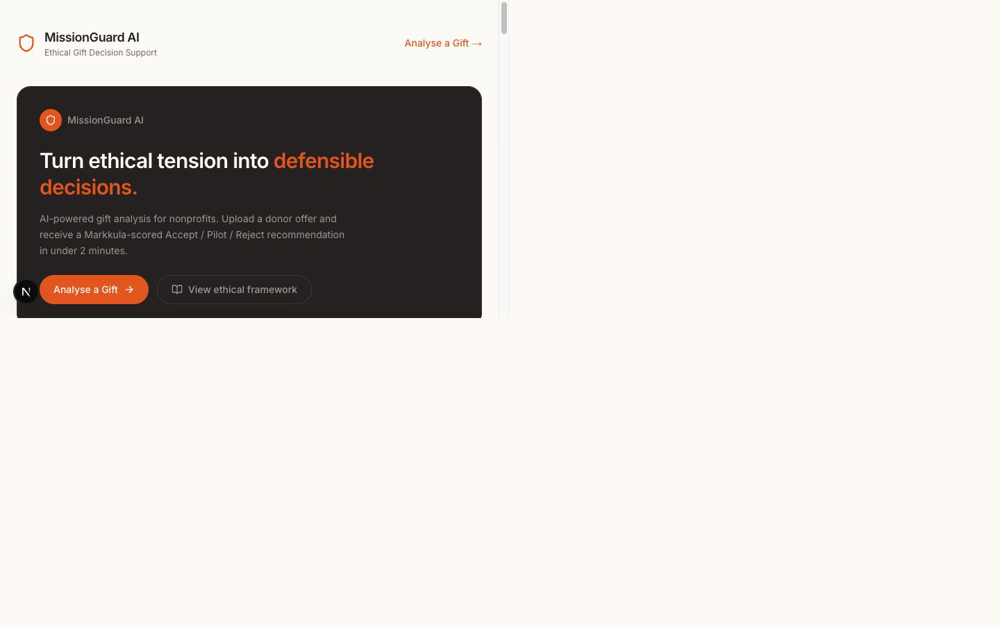
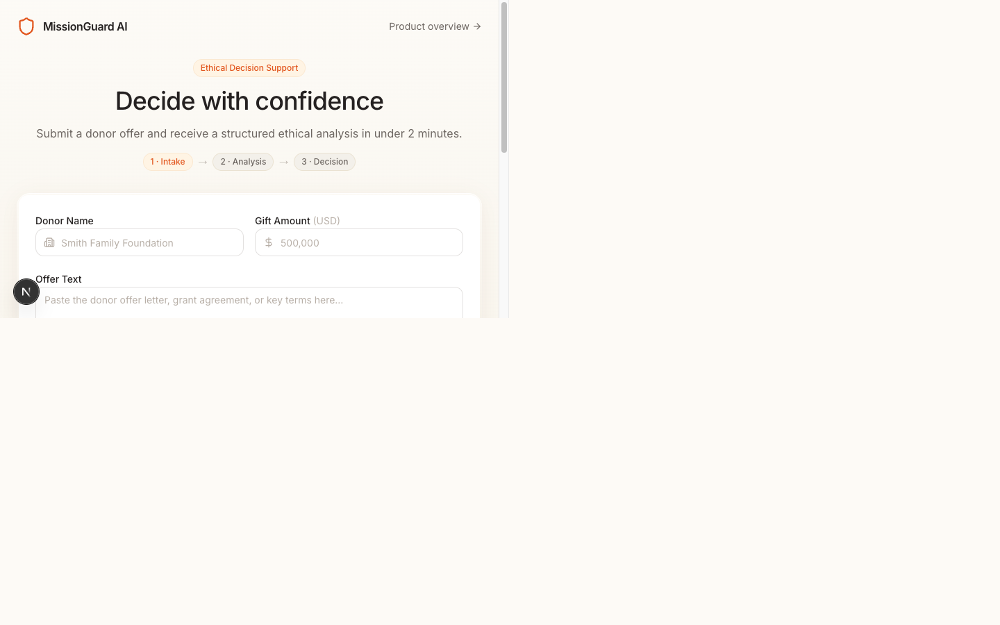

# MissionGuard AI

> AI-powered ethical decision-support platform for nonprofits navigating restricted-gift dilemmas.

Operationalises the **Modified Acceptance (Pilot Phase)** framework from the Markkula Center's "Follow the Money" case study, scored against the PMI Code of Ethics.

---

## Screenshots

| Product Overview | Donor Intake |
|------------------|--------------|
|  |  |

---

## Repository Layout

```
apps/
  web/        Next.js 15 + Tailwind + shadcn/ui  (frontend)
  api/        FastAPI + LangChain + LangGraph      (backend)
packages/
  ai/         Ethical Scoring Engine (Python)
  shared/     Pydantic & TypeScript shared schemas
```

---

## Quick Start

### Prerequisites
- Node ≥ 20 / npm ≥ 10
- Python 3.12+
- [uv](https://docs.astral.sh/uv/) (`pip install uv`)
- [Turbo](https://turbo.build/) (installed via `npm install`)

### 1. Install JS dependencies
```bash
npm install
```

### 2. Install Python dependencies
```bash
uv sync
```

### 3. Configure environment
```bash
cp apps/web/.env.example apps/web/.env.local
cp apps/api/.env.example apps/api/.env
```
Fill in your Supabase URL/key and Anthropic API key.

### 4. Run development servers
```bash
# Frontend (Next.js on :3000)
npm run dev --workspace=apps/web

# Backend (FastAPI on :8000)
cd apps/api && uv run uvicorn missionguard_api.main:app --reload
```

---

## Ethical Framework

The scoring engine implements the **5-step Markkula Framework** fused with **PMI Code of Ethics** weights:

$$E = 0.6 \cdot M + 0.4 \cdot P$$

where $M$ = Markkula lens score (0–100) and $P$ = PMI values score (0–100).  
**Line-Crossing rule:** if the Justice/Fairness lens ≤ −1 or any lens ≤ −1.5, $E$ is capped at 49 and the recommendation is forced to Pilot Phase or Reject.

See [MissionGuard_AI_Ethical_Framework_for_AI_Agents.md](./MissionGuard_AI_Ethical_Framework_for_AI_Agents.md) for the full operational constitution.

---

## Docs
| Document | Purpose |
|----------|---------|
| [MissionGuard_AI_PRD.md](./MissionGuard_AI_PRD.md) | Product Requirements (v1.0) |
| [MissionGuard_AI_Development_Plan.md](./MissionGuard_AI_Development_Plan.md) | Sprint roadmap & tech stack (v1.1) |
| [MissionGuard_AI_Ethical_Framework_for_AI_Agents.md](./MissionGuard_AI_Ethical_Framework_for_AI_Agents.md) | AI agent ethics constitution (v1.0) |

---

*Sprint 0 — April 28, 2026 | Author: Pascal Burume Buhendwa*
