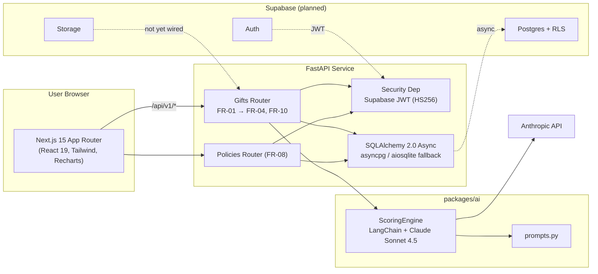
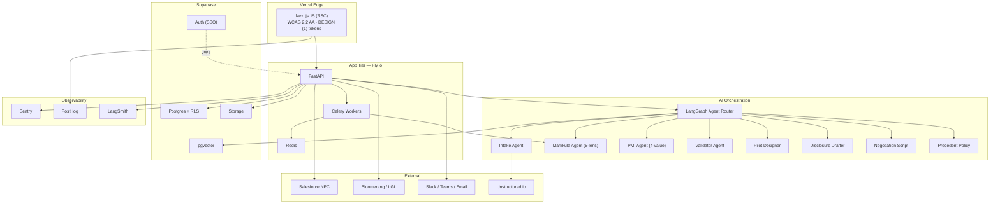
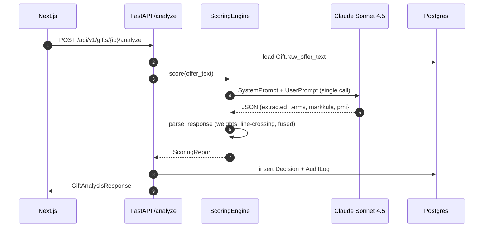
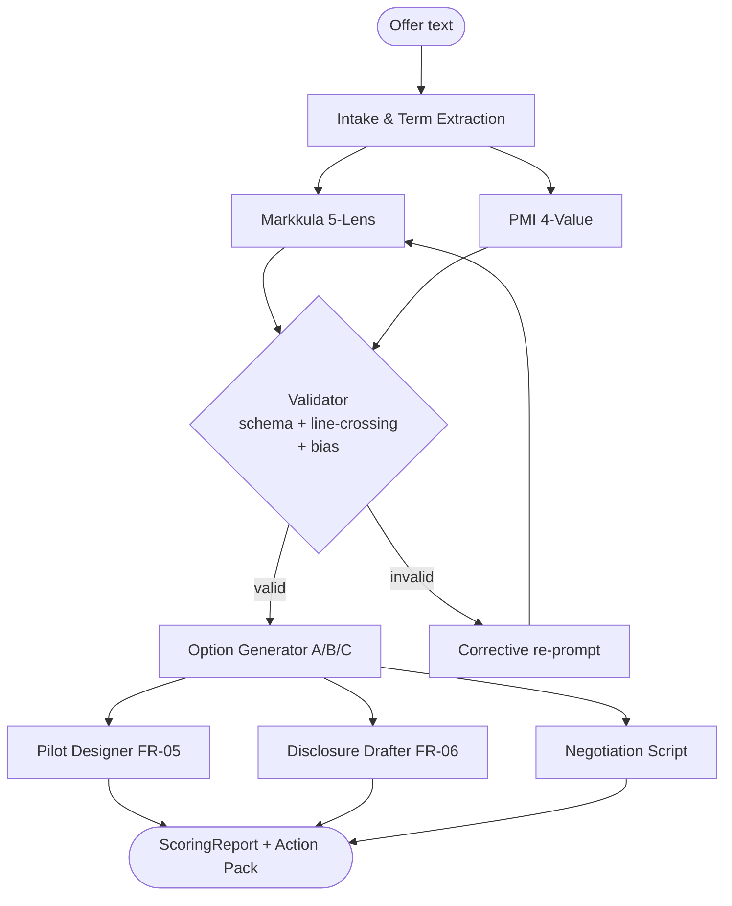
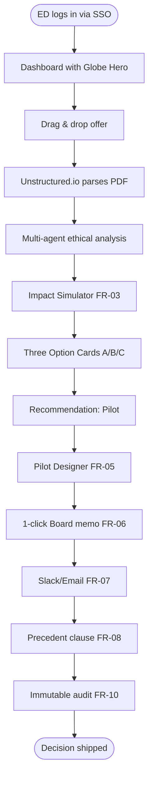
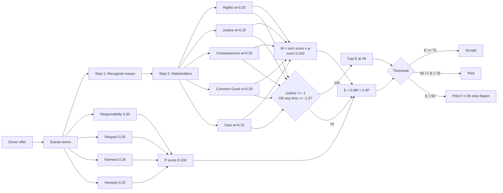
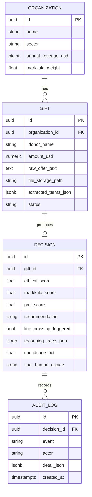
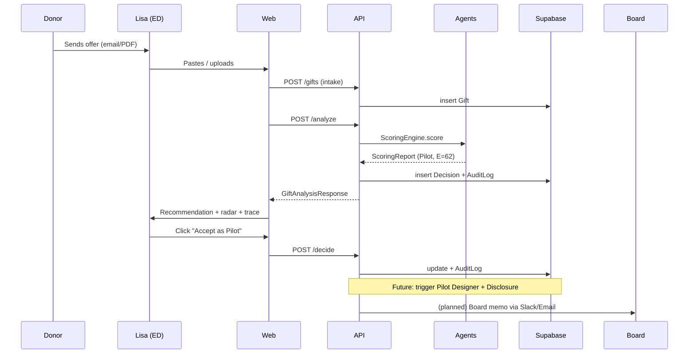

# MissionGuard AI — Repository Analysis

**Repository:** `MissionGuard AI platform`
**Analysis date:** April 28, 2026
**Analyst perspectives:** Software Architect · Software Developer · Product Manager
**Scope:** Full repository walk-through, gap analysis vs. PRD/Development Plan, and prioritised recommendations tied to the 12-week roadmap.

---

## 0. Repository Reality Check (Important Preamble)

The brief references three artefacts that **are not present** in the working tree. They are flagged here so the rest of the analysis stays grounded in what actually exists:

| Artefact referenced in brief | Status in repo | What was found instead |
|---|---|---|
| `missionguard_ai_app.py` (Streamlit prototype) | ❌ Not present | Production-grade scaffold: Next.js 15 frontend + FastAPI backend |
| `Follow_the_Money_Ethics_Presentation.pptx` | ❌ Not present | `.docx` versions of PRD / Dev Plan / Ethical Framework only |
| `follow_the_money_presentation.js` (PPTX generator) | ❌ Not present | — |
| `/home/workdir/artifacts` path | ❌ Not present | Actual root: `/Users/pascal/Search/MissionGuard AI platform` |
| `/designs` folder | ❌ Not present | Two design-token specs at root: `DESIGN (1).md`, `DESIGN (2).md` |

**Implication:** the project skipped the "Streamlit demo" stage entirely and went straight to the architecture proposed in §3 of the Development Plan. This is *ahead of plan* and is a strength, but means the analysis below benchmarks a real codebase against the PRD rather than a prototype.

**Design language confirmed by Product Owner:** **DESIGN (1) — PaperFlow palette**
Primary `#E65C00` (warm orange), Surface `#FDFBF7`, Neutral `#78716C`, Inter typography, glassy bounded grid, `9999px` pill buttons, `16px` card radius. All UI recommendations in this document are anchored to this token set.

---

## 1. Executive Summary

MissionGuard AI has progressed from a documents-only ethics case study into a **monorepo with a working full-stack scaffold and a real LLM-backed scoring engine**. The codebase implements the operational core of the *Modified Acceptance (Option C)* recommendation: a Markkula 5-lens + PMI 4-value fused score, the line-crossing rule, and a human-in-the-loop decision endpoint.

| Dimension | Maturity | Comment |
|---|---|---|
| Vision & ethics framework | 🟢 Excellent | PRD, Dev Plan, and Ethical Framework are tightly aligned |
| Backend skeleton (FastAPI + SQLAlchemy + Alembic) | 🟢 Solid | Async, typed, auth-gated, audit-logged |
| AI scoring engine (LangChain + Claude Sonnet 4.5) | 🟡 Real but thin | Single-prompt structured-JSON call; no validator agent yet |
| Frontend (Next.js 15 + shadcn + Recharts) | 🟡 Functional | Intake → Analyse → Decide vertical slice works; visual identity not yet on DESIGN (1) tokens |
| Multi-tenancy / RLS / Supabase wiring | 🔴 Stubbed | Models exist, RLS policies and Supabase client not wired |
| Pilot Designer, Disclosure Engine, Precedent DB | 🔴 Not started | FR-05/06/07/09 are in the PRD but not in code |
| Globe / "world of good" hero | 🔴 Not started | Home page is a basic gradient form; no globe yet |
| Tests & CI | 🟡 Seeded | Unit + smoke tests exist; no CI workflow file |

**Bottom line:** the repo is at a credible **end-of-Sprint 1.4** state per the Dev Plan timeline (week 7 of 12 in Phase 1). Closing the gap to MVP (Sprint 1.9, week 12) is realistic if the team prioritises the items in §7.

---

## 2. Repository Layout

```
MissionGuard AI platform/
├── apps/
│   ├── api/                        # FastAPI service (Python 3.12)
│   │   ├── missionguard_api/
│   │   │   ├── core/               # config, database, security
│   │   │   ├── routers/            # gifts, policies, health
│   │   │   ├── models.py           # SQLAlchemy ORM
│   │   │   ├── schemas.py          # Pydantic v2
│   │   │   └── main.py
│   │   ├── migrations/             # Alembic
│   │   └── tests/
│   └── web/                        # Next.js 15 App Router (React 19)
│       └── src/
│           ├── app/
│           │   ├── page.tsx                # Gift Intake
│           │   ├── analyze/[giftId]/       # Results + radar
│           │   └── decisions/[giftId]/     # Confirmation
│           ├── components/ui/              # shadcn primitives
│           └── lib/                        # api client, utils
├── packages/
│   ├── ai/                         # LangChain + Claude scoring engine
│   │   └── missionguard_ai/
│   │       ├── scoring_engine.py
│   │       └── prompts.py
│   └── shared/                     # @missionguard/shared TS types
├── DESIGN (1).md                   # ← PaperFlow palette (selected)
├── DESIGN (2).md                   # ← Bento Remix alternative
├── MissionGuard_AI_PRD.md
├── MissionGuard_AI_Development_Plan.md
├── MissionGuard_AI_Ethical_Framework_for_AI_Agents.md
├── pyproject.toml                  # uv workspace
├── package.json                    # npm workspaces + Turborepo
└── turbo.json
```

---

## 3. Software Architect Perspective

### 3.1 Current System Architecture



### 3.2 Target SaaS Architecture (PRD §6 + Dev Plan §3)



### 3.3 Architectural strengths

1. **Clear monorepo separation.** `apps/web`, `apps/api`, `packages/ai`, `packages/shared` — each with its own manifest. Turborepo + uv workspace are correctly wired.
2. **Shared contract via TypeScript types** mirroring Pydantic schemas (`packages/shared`). Prevents FE/BE drift on `GiftAnalysisResponse`/`HumanDecisionRequest`.
3. **Async-first backend** (`asyncpg`, `AsyncSession`). Future Celery integration won't require rewrites.
4. **Pure-logic separation in `ScoringEngine._parse_response`** allows unit-testing the scoring formula without an LLM call.
5. **JWT chokepoint** (`get_current_user`) is a single integration point for future RLS.

### 3.4 Architectural gaps & risks

| # | Gap | Risk | Recommendation |
|---|---|---|---|
| A1 | No queue for long LLM calls | Serverless timeout; blocked workers | Add Celery+Redis; turn `/analyze` into 202 + poll |
| A2 | `_engine = ScoringEngine()` at import | Boots fail w/o `ANTHROPIC_API_KEY`; un-mockable | Lazy `Depends(get_scoring_engine)` |
| A3 | No multi-tenant boundary | Cross-org data leak | `org_scope` mixin + Postgres RLS |
| A4 | PDF parsing is a stub | Real PDFs won't work | Supabase Storage + Unstructured.io in Celery |
| A5 | No LangGraph orchestration | Mega-prompt brittle | StateGraph w/ discrete agents |
| A6 | No CI workflow | Regressions land silently | GitHub Actions: ruff + mypy + pytest + tsc |
| A7 | No observability | Can't debug hallucinations | Sentry + LangSmith traces |
| A8 | API client doesn't attach JWT | 401 in prod | Supabase auth context |

### 3.5 Integration & scaling considerations

- **Multi-tenant isolation** is the single most important pending decision. SOC 2 Type II requires Postgres RLS + per-org Storage buckets, not just an `org_id` column.
- **Cost control on Claude.** ~3–5k input + ~2k output tokens per scoring call. At PRD's 50k concurrent users, batching, caching, and a Groq Llama-3.1-70B fallback (Dev Plan §5) become critical.
- **Determinism for audit.** `temperature=0.0` helps but doesn't pin model versions. Persist `model_id`, `prompt_hash`, and `langchain_version` on every `Decision` row.

---

## 4. Software Developer Perspective

### 4.1 Code quality snapshot

| Area | Verdict | Evidence |
|---|---|---|
| Type discipline | 🟢 Strong | Pydantic v2; TS strict; `tsc --noEmit` = 0 errors |
| Module boundaries | 🟢 Clear | Routers / models / schemas / core split is canonical |
| Error handling | 🟡 Partial | HTTPException at edges; `_call_llm` has no try/except around `json.loads` |
| Logging | 🔴 Absent | No `logging` calls anywhere |
| Tests | 🟡 Seeded | Line-crossing + PMI weighting + auth-gating; no E2E intake→analyse |
| Dead code | 🟢 None | Old Next.js boilerplate cleanly removed |

### 4.2 Concrete code-level findings

| # | File | Issue | Fix |
|---|---|---|---|
| D1 | `packages/ai/missionguard_ai/scoring_engine.py` (`_call_llm`) | `json.loads` raises on bad LLM output | try/except + Pydantic validator retry |
| D2 | same (`__init__`) | `ChatAnthropic` instantiated immediately | Defer or factory dependency |
| D3 | `apps/api/missionguard_api/routers/gifts.py` | `_engine = ScoringEngine()` at import | `Depends(get_scoring_engine)` |
| D4 | same (`upload_gift_document`) | PDF stringified, not parsed | Wire `unstructured` + Storage |
| D5 | `apps/api/missionguard_api/core/security.py` | HS256 with shared service-role key | Switch to JWKS RS256 in prod |
| D6 | `apps/web/src/lib/api.ts` | No Authorization header | Supabase auth interceptor |
| D7 | `apps/web/src/app/page.tsx` | Hard-coded `ORG_ID_PLACEHOLDER` | Pull from auth context |
| D8 | `apps/api/missionguard_api/core/config.py` | `ALLOWED_ORIGINS` is a string | `List[str]` + validator — already fixed |

### 4.3 Security posture (OWASP Top 10 quick pass)

| OWASP | Status | Note |
|---|---|---|
| A01 Broken access control | 🔴 Open | No org-scoping on queries |
| A02 Crypto failures | 🟡 | HS256 → RS256/JWKS |
| A03 Injection | 🟢 | ORM, parameterised |
| A04 Insecure design | 🟡 | No rate limit on `/analyze` |
| A05 Misconfiguration | 🟡 | CORS `*` default |
| A07 AuthN failures | 🟡 | No FE token refresh |
| A08 Integrity | 🟢 | Lockfiles present |
| A09 Logging failures | 🔴 Open | Zero logging; AuditLog only writes 1 event type |
| A10 SSRF | 🟢 | N/A |

### 4.4 AI-Agent implementation: current vs. target

#### Current (single-prompt structured output)



#### Target (LangGraph multi-agent with validator)



#### Incremental rollout (sprint-aligned)

| Sprint | Agent work | Effort |
|---|---|---|
| **1.5** | Wrap existing prompt in LangGraph `StateGraph` (single node); persist state | S |
| **1.6** | Split → `intake → markkula+pmi (parallel) → validator`; use `with_structured_output` | M |
| **1.7** | Add `ValidatorAgent` (Haiku); enforce line-crossing | M |
| **1.8** | Add `PilotDesigner` and `DisclosureDrafter` | M |
| **1.9** | Add `NegotiationScript` + `PrecedentPolicy`; emit LangSmith traces | S |
| **2.x** | Add pgvector `PrecedentRetriever` (FR-09) | L |

### 4.5 Top 3 cheap debt items to fix now

1. Pull `_engine` singleton out of router import-time → `Depends(get_scoring_engine)`.
2. Wrap `json.loads` with try/except + re-raise as a typed `ValueError`.
3. Add `logging` config in `core/__init__.py`.

---

## 5. Product Manager Perspective

### 5.1 PRD Feature Coverage

| FR | Feature | Priority | Status | Evidence |
|---|---|---|---|---|
| FR-01 | Gift Intake & NLP | P0 | 🟡 Text works, PDF stub | `routers/gifts.py` |
| FR-02 | PMI + Markkula scoring | P0 | 🟢 Implemented | `scoring_engine.py` |
| FR-03 | Impact Simulator | P0 | 🔴 Not started | — |
| FR-04 | Option Generator A/B/C | P0 | 🟡 Recommendation only | `analyze/[giftId]/page.tsx` |
| FR-05 | Pilot Designer | P0 | 🔴 Not started | — |
| FR-06 | Disclosure Report | P1 | 🔴 Not started | — |
| FR-07 | Notification workflow | P1 | 🔴 Not started | — |
| FR-08 | Precedent Policy | P1 | 🟡 Skeleton route | `routers/policies.py` |
| FR-09 | Historical DB | P2 | 🔴 Not started | — |
| FR-10 | Audit Trail | P0 | 🟡 Table + 1 event | `models.py AuditLog` |

**MVP coverage: ~35% of P0 fully shipped, ~30% partial, ~35% not started.**

### 5.2 Alignment to "Modified Acceptance (Option C)"

The decision logic in code **correctly defaults to Pilot**:
- `recommendation = "pilot"` whenever `50 ≤ E < 75` *or* line-crossing triggered (justice ≤ −1 OR any lens ≤ −1.5)
- The Analyze page surfaces **"Accept as Pilot" as the first / amber-highlighted button** — making the ethically correct choice the easiest choice.

This is the strongest code↔vision alignment in the repo. **Protect this with regression tests before any refactor.**

### 5.3 User Flow — Today

```mermaid
flowchart LR
  L([Lisa lands on /]) --> I[Gift Intake form]
  I --> S{Submit}
  S -- POST /gifts --> R1[gift_id created]
  R1 -- POST /analyze --> SC[Scoring engine ~5–15s]
  SC --> AN[/analyze/giftId page]
  AN --> V[Lisa sees: rec badge,\n5-lens radar, fused E,\n5-step trace]
  V --> D{Records decision}
  D -- POST /decide --> CONF[/decisions/giftId]
  CONF --> Done([Audit log written])
```

### 5.4 User Flow — Target



### 5.5 Ethical scoring & agent reasoning flow



### 5.6 Data model (current)



### 5.7 Donor offer → Disclosure data flow



### 5.8 UX/UI assessment (against DESIGN (1))

The current UI uses **slate/emerald** (`bg-slate-950`, `text-emerald-400`) — this **does not match DESIGN (1)**. Migration plan:

| Token | Current | DESIGN (1) target | Change |
|---|---|---|---|
| Background | slate-950→slate-800 gradient | `#FDFBF7 → #F7F4EB` warm | Replace `globals.css` HSL block |
| Primary action | `emerald-600` | `#E65C00` warm orange | Update Button + radar fill |
| Surface / cards | slate-800/900 | `#FFFFFF` glassy 16px + 4px gradient shell | Add glass-shell wrapper |
| Typography | Geist | **Inter** (display 48/500, body 12/400) | Swap font in `layout.tsx` |
| Radius | shadcn defaults | 8 / 16 / 40 / 9999 | Tighten Tailwind theme |
| Motion | none | 150–500ms ease, GSAP ScrollTrigger | Add `framer-motion` + 1 GSAP reveal |
| Body text | slate-100 | Text-primary `#78716C`, sec `#292524` | Re-theme |

### 5.9 Globe / "world of good" hero

| Option | Stack | Pros | Cons | Fit |
|---|---|---|---|---|
| **A. Three.js + R3F** | `@react-three/fiber` + custom Icosahedron + points | Premium feel; maps precedent decisions to glowing dots | Bundle +~150 KB; needs DPR clamp + DOM fallback | ⭐⭐⭐ Best |
| **B. `react-globe.gl`** | three-globe wrapper | Fastest to ship | Less aesthetic control | ⭐⭐ |
| **C. Plotly choropleth** | 2D map | Trivial | Flat, no metaphor | ⭐ |

**Recommendation:** Option A — `#E65C00` dots/arcs over `#292524` neutral globe, mapping anonymised decisions (pilot=`#E65C00`, accept=`#34D399`, reject=`#78716C`).

```tsx
// apps/web/src/components/globe/MissionGlobe.tsx (planned)
"use client";
import { Canvas } from "@react-three/fiber";
import { Icosahedron, Points, PointMaterial } from "@react-three/drei";
// Wireframe globe + glowing point per anonymised decision
// pilot=#E65C00, accept=#34D399, reject=#78716C
```

### 5.10 Design files status

- ✅ Token specs: `DESIGN (1).md` (selected), `DESIGN (2).md`
- ❌ **No `/designs` folder, no Figma export, no component screens**

**Recommended `/designs` structure:**
- `tokens.json` — machine-readable export feeding Tailwind config
- `components/` — Figma frame screenshots (Button, Card, RadarChart, Globe)
- `flows/` — Intake / Analyse / Decide / Pilot / Disclosure screens
- `README.md` linking source Figma file

### 5.11 Go-to-market readiness

| Gate | Status |
|---|---|
| E2E demo flow locally | 🟢 |
| Real Claude integration | 🟢 |
| Authenticated multi-user demo | 🔴 |
| Pilot Designer / Disclosure / Negotiation outputs | 🔴 |
| Branded UI on DESIGN (1) | 🔴 |
| Globe hero | 🔴 |
| Pricing page | 🔴 |
| Landing page copy | 🔴 |
| 30 seeded demo cases | 🔴 |
| Live Vercel + Fly.io deploy | 🔴 |

**Verdict:** ~6 weeks to a credible **closed-beta launch** (Milestone 1).

---

## 6. Cross-Cutting Insights

1. **Repo more mature than the brief assumed** — skipping Streamlit means less to throw away, but no quick internal demo.
2. **Ethical logic is the crown jewel** — line-crossing rule, lens weights, Pilot-default behaviour are unit-tested. Protect with regression tests.
3. **Vision-to-code traceability is excellent** — every PRD FR maps to a known file or known gap. Rare and valuable.
4. **Three crosscutting risks** for every sprint: (a) lack of multi-tenant isolation, (b) no LLM observability, (c) UI not on brand.
5. **Documentation drift risk is low** — PRD, Dev Plan, Ethical Framework cross-reference each other. Keep them versioned together.

---

## 7. Prioritised Recommendations (12-Week Roadmap)

### P0 — Must land before week 12 (MVP)

| # | Action | Sprint | Owner | Effort |
|---|---|---|---|---|
| P0-1 | Real Supabase Auth (JWKS) + RLS on `gifts/decisions/audit_logs` | 1.5 | Tech Lead | M |
| P0-2 | Replace UI palette with **DESIGN (1)** tokens | 1.5 | FE | M |
| P0-3 | Refactor ScoringEngine to LangGraph + Validator Agent + retry | 1.6 | AI Lead | M |
| P0-4 | Supabase Storage + Unstructured.io for real PDF parsing | 1.6 | BE | M |
| P0-5 | Celery worker for `/analyze` (202 + poll endpoint) | 1.7 | Tech Lead | M |
| P0-6 | Pilot Designer (FR-05) + Disclosure Drafter (FR-06) | 1.7-1.8 | FE + AI | L |
| P0-7 | **Globe hero** (Three.js + R3F, Option A) | 1.8 | FE | M |
| P0-8 | CI: ruff + mypy + pytest + tsc; Sentry + LangSmith | 1.8 | Tech Lead | S |
| P0-9 | 30 seeded synthetic cases for demo | 1.9 | Pascal | S |
| P0-10 | Ship to Vercel + Fly.io with Supabase prod project | 1.9 | Tech Lead | M |

### P1 — Beta (weeks 13–20)

- Precedent Policy generator full implementation (FR-08)
- Historical Precedent DB with pgvector (FR-09)
- Slack/Email notifications (FR-07)
- Salesforce / Bloomerang integrations
- WCAG 2.2 AA audit + mobile-responsive pass

### P2 — Scale (weeks 21+)

- Public API + ethics-as-a-service white-label
- On-prem / VPC deployment story
- Markkula Center / Nonprofit Quarterly partnership case studies

---

## 8. Appendix — File Index

| Path | Purpose |
|---|---|
| `MissionGuard_AI_PRD.md` | Product Requirements (v1.0) |
| `MissionGuard_AI_Development_Plan.md` | 12-week roadmap (v1.1) |
| `MissionGuard_AI_Ethical_Framework_for_AI_Agents.md` | Markkula + IEEE constitution |
| `DESIGN (1).md` | **Selected** PaperFlow tokens |
| `DESIGN (2).md` | Bento Remix alternative |
| `apps/api/missionguard_api/main.py` | FastAPI entrypoint |
| `apps/api/missionguard_api/models.py` | SQLAlchemy models |
| `apps/api/missionguard_api/routers/gifts.py` | Core lifecycle (FR-01→04, FR-10) |
| `apps/api/missionguard_api/routers/policies.py` | Precedent Policy stub (FR-08) |
| `packages/ai/missionguard_ai/scoring_engine.py` | Markkula+PMI fused scoring (FR-02) |
| `packages/ai/missionguard_ai/prompts.py` | LLM system + user prompt |
| `packages/shared/src/index.ts` | Shared TS types |
| `apps/web/src/app/page.tsx` | Gift Intake page |
| `apps/web/src/app/analyze/[giftId]/page.tsx` | Analysis & decision |
| `apps/web/src/app/decisions/[giftId]/page.tsx` | Decision confirmation |

---

*Document version: 1.0 — April 28, 2026.*
*Advisory; subject to Product Owner approval (Pascal Burume Buhendwa).*
